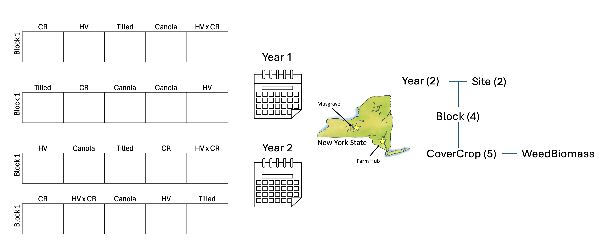
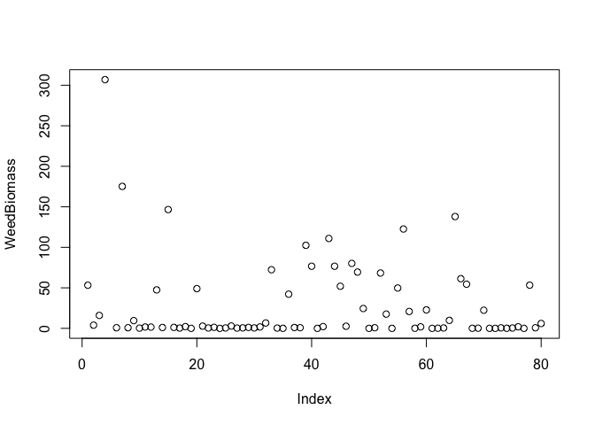
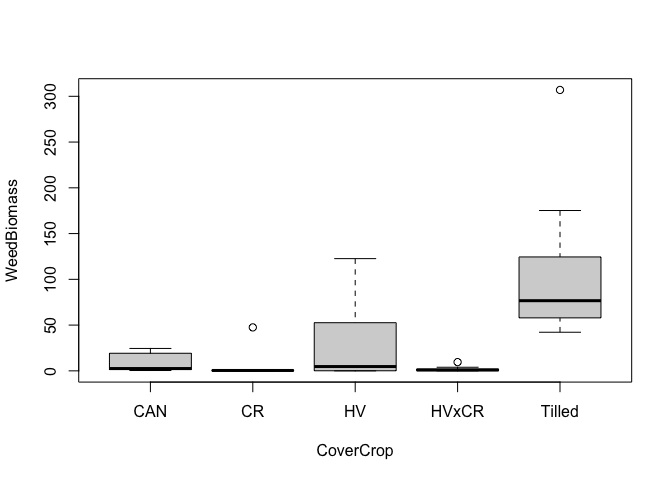
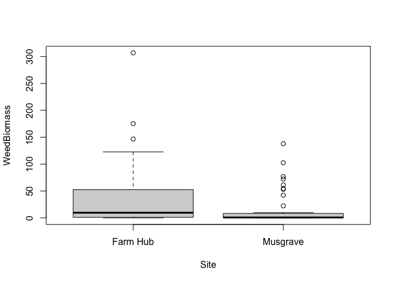
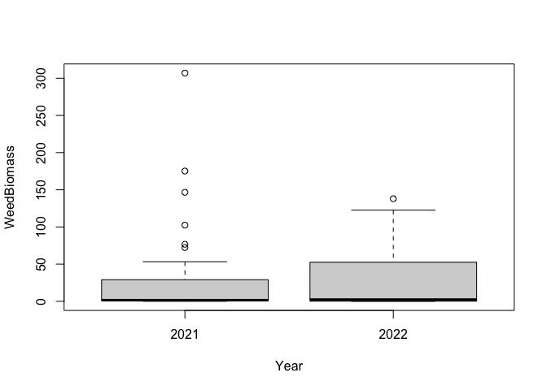
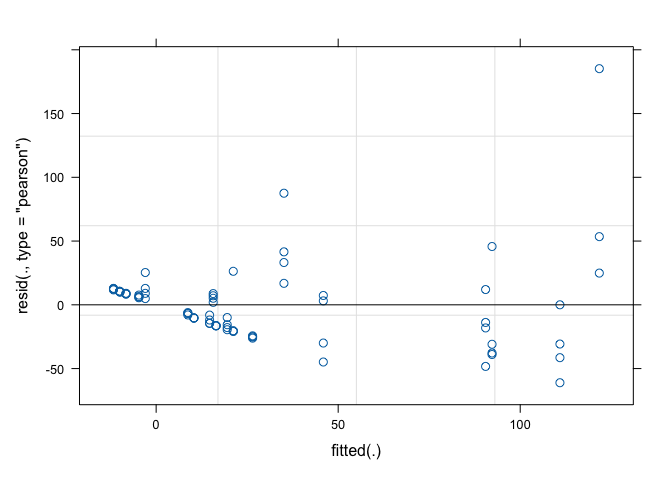
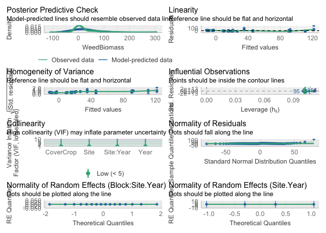
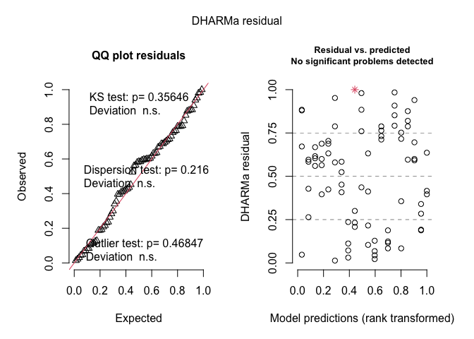
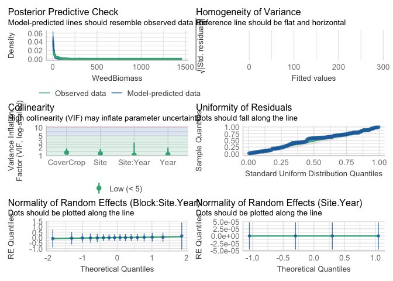

Random effects demo
================

\#Loading

``` r
library(lmerTest)
```

    ## Loading required package: lme4

    ## Loading required package: Matrix

    ## 
    ## Attaching package: 'lmerTest'

    ## The following object is masked from 'package:lme4':
    ## 
    ##     lmer

    ## The following object is masked from 'package:stats':
    ## 
    ##     step

``` r
library(performance)
```

    ## Warning: package 'performance' was built under R version 4.4.1

``` r
library(glmmTMB)
library(DHARMa)
```

    ## This is DHARMa 0.4.6. For overview type '?DHARMa'. For recent changes, type news(package = 'DHARMa')

``` r
library(tidyverse)
```

    ## Warning: package 'lubridate' was built under R version 4.4.1

    ## ── Attaching core tidyverse packages ──────────────────────── tidyverse 2.0.0 ──
    ## ✔ dplyr     1.1.4     ✔ readr     2.1.5
    ## ✔ forcats   1.0.0     ✔ stringr   1.5.1
    ## ✔ ggplot2   3.5.1     ✔ tibble    3.2.1
    ## ✔ lubridate 1.9.4     ✔ tidyr     1.3.1
    ## ✔ purrr     1.0.2

    ## ── Conflicts ────────────────────────────────────────── tidyverse_conflicts() ──
    ## ✖ tidyr::expand() masks Matrix::expand()
    ## ✖ dplyr::filter() masks stats::filter()
    ## ✖ dplyr::lag()    masks stats::lag()
    ## ✖ tidyr::pack()   masks Matrix::pack()
    ## ✖ tidyr::unpack() masks Matrix::unpack()
    ## ℹ Use the conflicted package (<http://conflicted.r-lib.org/>) to force all conflicts to become errors

``` r
options(contrasts = c("contr.sum", "contr.poly")) #setting contrasts
```

Today we will be using a subset of data published in Menalled et
al. (2023): <https://doi.org/10.1038/s41598-023-43987-x>

This experiment looks at changes in weed communities across 10 cover
crop treatments (5 summer cover crop treatments, 5 winter cover crop
treatments). Today, we will just work with winter cover crops
(i.e. tilled control, canola, cereal rye (CR), hairy vetch (HV), and HV
x CR mix).

``` r
#Each year is stored separately, I'll load them in, calculate total weed biomass, and combind the dataframes
WintData1_tmp <- read.csv("https://ecommons.cornell.edu/server/api/core/bitstreams/adb24a0c-0b2c-4bd6-90ad-e203c270bba3/content")
WintData2_tmp <- read.csv("https://ecommons.cornell.edu/server/api/core/bitstreams/f05bf7b9-3c15-48ec-9f28-0c978cf0560b/content")

str(WintData1_tmp) #loaded in nicely
str(WintData2_tmp) #loaded in nicely

#We don't want to do weed community analysis today, just simple models of total weed biomass
WintData1 <-
  WintData1_tmp %>% 
  rowwise() %>%
  mutate(WeedBiomass = sum(c_across(-c(Trial, Year, Site, Block, Plot, CoverCrop, CoverCropBiomass, canola, 
                                       cereal.rye, hairy.vetch)), na.rm = FALSE)) %>% 
  ungroup() %>% 
  select(Year, Site, Block, Plot, CoverCrop,WeedBiomass)

WintData2 <-
  WintData2_tmp %>% 
  rowwise() %>%
  mutate(WeedBiomass = sum(c_across(-c(Trial, Year, Site, Block, Plot, CoverCrop, CoverCropBiomass, canola, 
                                       cereal.rye, hairy.vetch)), na.rm = FALSE)) %>%
  ungroup() %>% 
  select(Year, Site, Block, Plot, CoverCrop,WeedBiomass)

#Combine data frames
WintData_tmp <- bind_rows(WintData1,WintData2)

WintData <- WintData_tmp %>% mutate(across(-WeedBiomass, as.factor))
str(WintData) #looks good!
```

\#Modeling

I want to see how weed biomass is impacted by cover crop treatment,
basically WeedBiomass~CoverCrop. However, my experiment has clear
nesting! I must account for non-independence through a model with more
fixed and/or random effects. Looking at my experimental design (picture
below) we can see that there are **three** *total* levels.

1.  Site and Year are at an equal level because both sites are in both
    years and visa versa. there are 2 levels of each site and year

2.  Block is within Site and Year. I know this because we used different
    fields in each site year, so block 1 in Musgrave during year 1 **is
    not** the same as block 1 in Musgrave during year 2. Because each
    block is within a unique site year, there are 2 sites x 2 years x 4
    blocks = 16 groups.

3.  Cover crop treatments are within blocks, this is the level at which
    I made my observations.

As nice it would be to account for Site and Year through a random
effect, we don’t have enough levels of either group. Remember we need at
least three groups per variable for it to be a random effect. Thus,
these variables will be fixed effects. On the other hand, site.year has
4 groups (iffy, but let’s just try) and block has 16 levels across
site-years (nice, that’s a solid amount of groups for a RE). As for
CoverCrop, this is the level of observation, it does not need to be a
random effect.

<figure>

<figcaption aria-hidden="true">Here is a nice picture of the map and
experimental design of the data we are working with today</figcaption>
</figure>

``` r
#create Site.Year variable
WintData$Site.Year <- paste(WintData$Site,WintData$Year,sep = ".")
WintData$Site.Year <- as.factor(WintData$Site.Year)


#let's get a sense of what we are working with...
#We'll probably be working with a Tweedie glmer because 
plot(WeedBiomass~1, data = WintData) #a cluster of points with near zero weed biomass, probably 
```

<!-- -->

``` r
plot(WeedBiomass~CoverCrop*Site*Year, data = WintData) #non-normally distributed around treatments
```

<!-- --><!-- --><!-- -->

``` r
#let's get modeling

#simple lmer first
WeedBio_Mod1 <- lmer(WeedBiomass~Site*Year + CoverCrop + (1|Site.Year/Block), data = WintData)
```

    ## boundary (singular) fit: see help('isSingular')

    ## Warning in as_lmerModLT(model, devfun): Model may not have converged with 1
    ## eigenvalue close to zero: -1.3e-09

``` r
#singularity issues from RE of Block:Site.Year = 0, could be okay if anova DF are good
summary(WeedBio_Mod1) #RE captured correctly because number of groups in RE follows design
```

    ## Linear mixed model fit by REML. t-tests use Satterthwaite's method [
    ## lmerModLmerTest]
    ## Formula: WeedBiomass ~ Site * Year + CoverCrop + (1 | Site.Year/Block)
    ##    Data: WintData
    ## 
    ## REML criterion at convergence: 728.5
    ## 
    ## Scaled residuals: 
    ##     Min      1Q  Median      3Q     Max 
    ## -1.8458 -0.4970  0.0584  0.3143  5.5951 
    ## 
    ## Random effects:
    ##  Groups          Name        Variance Std.Dev.
    ##  Block:Site.Year (Intercept)    0.00   0.000  
    ##  Site.Year       (Intercept)   71.32   8.445  
    ##  Residual                    1095.66  33.101  
    ## Number of obs: 79, groups:  Block:Site.Year, 16; Site.Year, 4
    ## 
    ## Fixed effects:
    ##             Estimate Std. Error      df t value Pr(>|t|)    
    ## (Intercept)   29.088      5.632  71.000   5.165 2.11e-06 ***
    ## Site1         12.471      5.632  71.000   2.214 0.030007 *  
    ## Year1          2.263      5.632  71.000   0.402 0.688998    
    ## CoverCrop1   -20.480      7.414  71.000  -2.762 0.007306 ** 
    ## CoverCrop2   -25.782      7.414  71.000  -3.477 0.000869 ***
    ## CoverCrop3    -1.049      7.414  71.000  -0.141 0.887940    
    ## CoverCrop4   -27.448      7.414  71.000  -3.702 0.000419 ***
    ## Site1:Year1    3.147      5.632  71.000   0.559 0.578100    
    ## ---
    ## Signif. codes:  0 '***' 0.001 '**' 0.01 '*' 0.05 '.' 0.1 ' ' 1
    ## 
    ## Correlation of Fixed Effects:
    ##             (Intr) Site1  Year1  CvrCr1 CvrCr2 CvrCr3 CvrCr4
    ## Site1        0.006                                          
    ## Year1        0.006  0.006                                   
    ## CoverCrop1  -0.005 -0.005 -0.005                            
    ## CoverCrop2  -0.005 -0.005 -0.005 -0.246                     
    ## CoverCrop3  -0.005 -0.005 -0.005 -0.246 -0.246              
    ## CoverCrop4  -0.005 -0.005 -0.005 -0.246 -0.246 -0.246       
    ## Site1:Year1  0.006  0.006  0.006 -0.005 -0.005 -0.005 -0.005
    ## optimizer (nloptwrap) convergence code: 0 (OK)
    ## boundary (singular) fit: see help('isSingular')

``` r
plot(WeedBio_Mod1) #terrible, as expected
```

<!-- -->

``` r
check_model(WeedBio_Mod1) #I'm mainly interested in pp_check (looks bad) and random effects check (looks okay)
```

<!-- -->

``` r
anova(WeedBio_Mod1) #while numerator DF look good, denominator degrees of freedom are 0, this comes from the singularity and is WRONG 
```

    ## Type III Analysis of Variance Table with Satterthwaite's method
    ##           Sum Sq Mean Sq NumDF DenDF F value    Pr(>F)    
    ## Site        5373  5373.0     1    71  4.9039   0.03001 *  
    ## Year         177   176.9     1    71  0.1615   0.68900    
    ## CoverCrop 112957 28239.2     4    71 25.7737 3.271e-13 ***
    ## Site:Year    342   342.0     1    71  0.3122   0.57810    
    ## ---
    ## Signif. codes:  0 '***' 0.001 '**' 0.01 '*' 0.05 '.' 0.1 ' ' 1

``` r
anova(WeedBio_Mod1, ddf = "Kenward-Roger") #numerator AND denominator DF look good. Denominator df are all less then measurement number (80 plots) so good. If I added some predictor variable at a higher level then, it would have to have less denominator degrees of freedom than it's replication (i.e. if soil type was only across site.year.block, then its DenDF should not be more than 16)
```

    ## Type III Analysis of Variance Table with Kenward-Roger's method
    ##           Sum Sq Mean Sq NumDF  DenDF F value    Pr(>F)    
    ## Site        5371  5371.2     1 62.422  4.9022   0.03048 *  
    ## Year         177   176.9     1 62.422  0.1614   0.68921    
    ## CoverCrop 112639 28159.8     4 59.285 25.7012 2.231e-12 ***
    ## Site:Year    342   341.9     1 62.422  0.3121   0.57841    
    ## ---
    ## Signif. codes:  0 '***' 0.001 '**' 0.01 '*' 0.05 '.' 0.1 ' ' 1

``` r
#now glmer
WeedBio_Mod2 <- glmmTMB(WeedBiomass~Site*Year + CoverCrop + (1|Site.Year/Block),
                        family = tweedie(link = "log"),
                        data = WintData)
summary(WeedBio_Mod2) #RE captured correctly because number of groups in RE follows design
```

    ##  Family: tweedie  ( log )
    ## Formula:          WeedBiomass ~ Site * Year + CoverCrop + (1 | Site.Year/Block)
    ## Data: WintData
    ## 
    ##      AIC      BIC   logLik deviance df.resid 
    ##    503.3    531.7   -239.6    479.3       67 
    ## 
    ## Random effects:
    ## 
    ## Conditional model:
    ##  Groups          Name        Variance  Std.Dev. 
    ##  Block:Site.Year (Intercept) 2.786e-02 1.669e-01
    ##  Site.Year       (Intercept) 5.935e-10 2.436e-05
    ## Number of obs: 79, groups:  Block:Site.Year, 16; Site.Year, 4
    ## 
    ## Dispersion parameter for tweedie family (): 2.23 
    ## 
    ## Conditional model:
    ##             Estimate Std. Error z value Pr(>|z|)    
    ## (Intercept)  2.06149    0.16613  12.409  < 2e-16 ***
    ## Site1        0.77195    0.16085   4.799 1.59e-06 ***
    ## Year1       -0.03369    0.15743  -0.214   0.8306    
    ## CoverCrop1   0.03726    0.29381   0.127   0.8991    
    ## CoverCrop2  -1.46188    0.37533  -3.895 9.82e-05 ***
    ## CoverCrop3   0.72355    0.28169   2.569   0.0102 *  
    ## CoverCrop4  -1.91508    0.31750  -6.032 1.62e-09 ***
    ## Site1:Year1  0.09991    0.15392   0.649   0.5163    
    ## ---
    ## Signif. codes:  0 '***' 0.001 '**' 0.01 '*' 0.05 '.' 0.1 ' ' 1

``` r
simulateResiduals(WeedBio_Mod2, plot = TRUE) #much better, good enough to publish
```

    ## Unable to calculate quantile regression for quantile 0.25. Possibly to few (unique) data points / predictions. Will be ommited in plots and significance calculations.

    ## Unable to calculate quantile regression for quantile 0.5. Possibly to few (unique) data points / predictions. Will be ommited in plots and significance calculations.

    ## Unable to calculate quantile regression for quantile 0.75. Possibly to few (unique) data points / predictions. Will be ommited in plots and significance calculations.

<!-- -->

    ## Object of Class DHARMa with simulated residuals based on 250 simulations with refit = FALSE . See ?DHARMa::simulateResiduals for help. 
    ##  
    ## Scaled residual values: 0.752 0.788 0.356 0.636 0.232 0.416 0.3 0.952 0.208 0.58 0.124 1 0.084 0.396 0.116 0.084 0.188 0.01347419 0.716 0.412 ...

``` r
check_model(WeedBio_Mod2) #pp_check still shows some error around 0. All RE look good. Good enough!
```

    ## `check_outliers()` does not yet support models of class `glmmTMB`.

<!-- -->

``` r
car::Anova(WeedBio_Mod2, type = 3) #unfortunately only car::Anova is possible for glmmTMB. but no singularity warning, so I feel good 
```

    ## Analysis of Deviance Table (Type III Wald chisquare tests)
    ## 
    ## Response: WeedBiomass
    ##                Chisq Df Pr(>Chisq)    
    ## (Intercept) 153.9873  1  < 2.2e-16 ***
    ## Site         23.0327  1  1.593e-06 ***
    ## Year          0.0458  1     0.8306    
    ## CoverCrop   130.3030  4  < 2.2e-16 ***
    ## Site:Year     0.4213  1     0.5163    
    ## ---
    ## Signif. codes:  0 '***' 0.001 '**' 0.01 '*' 0.05 '.' 0.1 ' ' 1
